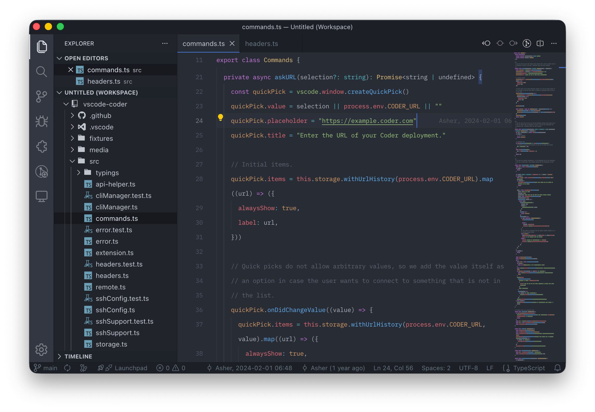

### Mario Theme - A Modern Dark Theme for VSCode

Elevate your coding experience with Mario Theme, a meticulously crafted dark theme designed for clarity, comfort, and productivity. Built with a deep focus on readability and visual harmony, this theme transforms your editor into a sleek workspace where code stands out without eye strain.

#### Key Features

- **Rich Color Palette**: A balanced combination of vibrant yet non-intrusive colors ensures syntax elements are easily distinguishable.
- **Terminal Optimization**: The theme includes a matching terminal color scheme with bright, distinct ANSI colors that maintain consistency with the editor palette.
- **Minimal Distractions**: The background (#282C34) provides a comfortable contrast ratio that reduces eye fatigue during long coding sessions.

#### Screenshot

#### Why Choose Mario Theme?

- **Enhanced Readability**: The carefully selected color palette ensures that every token type (variables, functions, keywords, strings) is easily distinguishable.
- **Consistent Experience**: From editor to terminal, the theme maintains a cohesive look that keeps your workflow seamless.
- **Optimized for Long Sessions**: The dark background with balanced contrast reduces eye strain, making it ideal for extended coding periods.
- **Wide Language Support**: Works great with all major programming languages including JavaScript, TypeScript, Python, Go, and more.

#### Installation

1. Open VSCode
2. Go to Extensions (Ctrl+Shift+X)
3. Search for "Mario Theme"
4. Click Install
5. Click Reload to activate the theme

#### License

MIT
